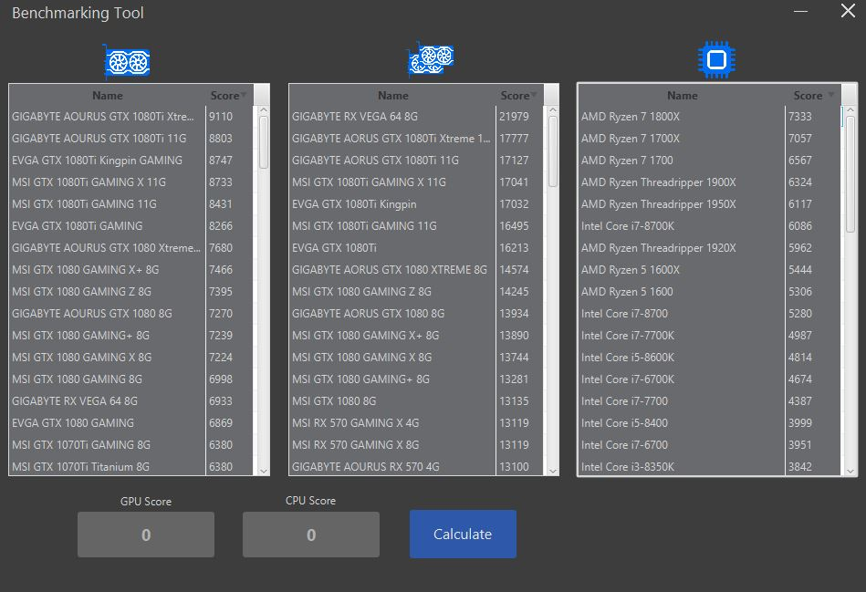

# Benchmark Calculator

Initially created to PC Building Simulator as an aid tool. Listed all GPU and CPU hardwares, user can choose from the list or 
add manually the score points of each and calculate the final benchmark point. 
It is fully functional however not bug free, if you interested to the project, feel free to contribute.

 

 

Graphical components source: 
https://www.flaticon.com/authors/srip 
https://www.freepik.com/
